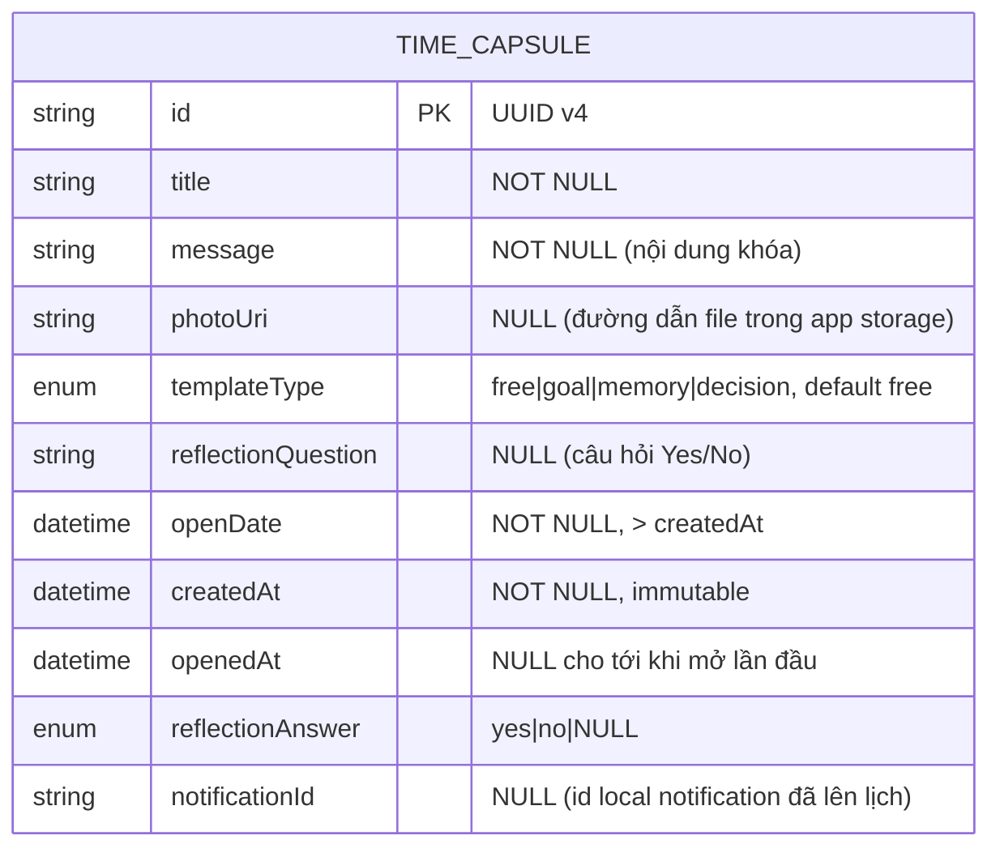

# Database Design — FutureBoxes

Nguồn: PRD.md mục 3 (mô hình dữ liệu Time Capsule), mục 6 (NFR — khuyến nghị MMKV + file system), mục 7 (A1–A9).

- Ngày: 2026-07-24
- Tác giả: agent-ba
- Phạm vi: MVP, offline-only, không backend.

---

## 1. Quyết định thiết kế

| Quyết định | Lý do |
|---|---|
| **Chỉ 1 entity `TimeCapsule`** | Toàn bộ nghiệp vụ MVP xoay quanh một thực thể. Không có quan hệ 1-n hay n-n thực sự cần bảng phụ. |
| **`templateType` là ENUM, KHÔNG tách bảng `Template`** | 4 template (`free/goal/memory/decision`) chỉ là **preset tĩnh** dùng để prefill gợi ý nội dung + `reflectionQuestion` mặc định *tại thời điểm tạo hộp*. Sau khi tạo, giá trị đã được copy vào chính bản ghi hộp (`message`, `reflectionQuestion`). Bảng Template chỉ chứa hằng số → nên khai báo trong code (một object hằng), không phải trong storage. Thêm template mới = thêm 1 hằng số, không đổi schema (khớp NFR "thêm template không đổi schema"). |
| **Ảnh lưu ở file system, chỉ lưu `photoUri` trong store** | MMKV tối ưu cho giá trị nhỏ; không nhồi binary. (A7, NFR mục 6) |
| **`status` là trường dẫn xuất, KHÔNG persist** | `status` được tính từ `openDate`, `openedAt` và `now` bằng một hàm thuần dùng chung. Persist `status` sẽ gây stale (hộp tới hạn nhưng vẫn `locked` cho tới khi ghi lại). Chỉ persist `openedAt` (sự kiện thật, immutable). Xem §5. |

---

## 2. Entity-Relationship Diagram (mô hình quan hệ logic)

ERD vẽ theo mô hình quan hệ chuẩn để rõ ràng về mặt logic; cách map sang MMKV ở §4.



Ghi chú quan hệ: MVP không có entity nào khác nên không có quan hệ liên bảng. `templateType` tham chiếu tới tập preset khai báo trong code (không phải khóa ngoại tới bảng).

---

## 3. Table Schema chi tiết

Bảng logic `TimeCapsule`. Kiểu dữ liệu ghi theo JS/TS (giá trị JSON trong MMKV).

| Field | Kiểu (TS) | Bắt buộc | Ràng buộc | Mô tả |
|---|---|---|---|---|
| `id` | `string` | ✅ | PK, unique, UUID v4 | Sinh khi tạo hộp. |
| `title` | `string` | ✅ | non-empty (sau trim) | Tiêu đề ngắn. Hiển thị cả khi hộp đang khóa. |
| `message` | `string` | ✅ | non-empty (sau trim) | Nội dung khóa. **Ẩn khi `now < openDate`** (F2). Immutable sau khi tạo. |
| `photoUri` | `string \| null` | ❌ | file URI hợp lệ trong app storage | 0..1 ảnh (A7). Ẩn khi chưa tới hạn (F2). |
| `templateType` | `'free' \| 'goal' \| 'memory' \| 'decision'` | ✅ | enum, default `'free'` | Chỉ để phân loại/hiển thị; nội dung đã copy sang các trường khác lúc tạo. |
| `reflectionQuestion` | `string \| null` | ❌ | — | Câu hỏi Yes/No khi mở. Template gợi ý sẵn, user sửa được (F9). `null` = bỏ qua bước phản tư. |
| `openDate` | `string (ISO 8601)` | ✅ | `> createdAt`, timezone local (A9) | Thời điểm được phép mở. |
| `createdAt` | `string (ISO 8601)` | ✅ | immutable, = thời điểm tạo | Hiển thị "Bạn đã gửi vào ngày…" khi mở. |
| `openedAt` | `string (ISO 8601) \| null` | ❌ | set 1 lần khi mở lần đầu, immutable sau đó | Sự kiện mở thật. Là mốc bất biến quyết định trạng thái `opened` (không tính ngược — Reliability NFR). |
| `reflectionAnswer` | `'yes' \| 'no' \| null` | ❌ | chỉ set khi đã mở & có `reflectionQuestion`; ghi 1 lần (F11) | Câu trả lời phản tư. |
| `notificationId` | `string \| null` | ❌ | id trả về từ `scheduleNotificationAsync` | Để hủy notification khi xóa hộp (F10). `null` nếu không cấp quyền / không lên lịch được. |

Validation rules chính (tầng business, agent-react thực thi):
- `title.trim()` và `message.trim()` không rỗng → nếu rỗng, chặn "Khóa hộp".
- `openDate > now` tại thời điểm bấm khóa → nếu không, báo lỗi, không lưu (F1 AC).
- `reflectionAnswer` chỉ được ghi khi `openedAt != null` và `reflectionQuestion != null`.

---

## 4. Map sang MMKV (react-native-mmkv)

MMKV là key-value; object lưu bằng `JSON.stringify`. Không có "bảng", nên mô phỏng như sau:

### 4.1. Key pattern

| Key | Giá trị | Mục đích |
|---|---|---|
| `capsule:<id>` | JSON của 1 `TimeCapsule` | Bản ghi hộp. |
| `capsule:index` | JSON `string[]` — mảng tất cả `id` | Danh sách ID để liệt kê (thay cho "SELECT * FROM"). MMKV không có "list all keys theo prefix" hiệu quả về mặt nghiệp vụ → tự quản index. |

Ví dụ:
```
capsule:index  →  ["a1b2...","c3d4...","e5f6..."]
capsule:a1b2...  →  {"id":"a1b2...","title":"Ôn thi","message":"...","openDate":"2026-08-01T09:00:00","createdAt":"2026-07-24T...","openedAt":null,...}
```

### 4.2. Thao tác CRUD ↔ key

| Nghiệp vụ | Thao tác MMKV |
|---|---|
| Tạo hộp (F1) | `set('capsule:<id>', JSON)` **rồi** push `<id>` vào `capsule:index` và `set('capsule:index', JSON)`. Thứ tự: ghi bản ghi trước, cập nhật index sau (nếu index chưa có id mà bản ghi mất → mồ côi vô hại; ngược lại index trỏ tới bản ghi rỗng → tránh). |
| List (F3) | Đọc `capsule:index` → loop `get('capsule:<id>')` → `JSON.parse`. |
| Mở hộp (F4) | Đọc bản ghi, set `openedAt`, ghi lại `capsule:<id>`. |
| Trả lời phản tư (F5) | Set `reflectionAnswer`, ghi lại `capsule:<id>`. |
| Xóa hộp (F10) | `delete('capsule:<id>')` + gỡ `<id>` khỏi `capsule:index` + `delete` file ảnh (`photoUri`) + hủy notification (`notificationId`). |

### 4.3. Mã hóa & ảnh
- Bật mã hóa MMKV (`new MMKV({ id, encryptionKey })`) cho quyền riêng tư nội dung hộp (Security NFR). Khóa mã hóa lưu ở secure storage (expo-secure-store) — chi tiết ở giai đoạn Implementation.
- Ảnh: **không** vào MMKV. `expo-image-picker` chọn → `expo-file-system` copy vào thư mục app → chỉ lưu `photoUri` (đường dẫn) trong bản ghi.

---

## 5. Trạng thái dẫn xuất (`status`)

`status` KHÔNG lưu. Một hàm thuần dùng chung mọi màn:

```
deriveStatus(capsule, now):
  if capsule.openedAt != null   → 'opened'   // bất biến: đã mở là đã mở
  else if now >= capsule.openDate → 'ready'
  else                          → 'locked'
```

Lý do (Reliability NFR): nếu người dùng chỉnh đồng hồ hệ thống về quá khứ, hộp đã `opened` vẫn `opened` (dựa trên `openedAt` đã ghi, không tính lại ngược). Chỉ chuyển `locked→ready` là phụ thuộc `now`, đánh giá lại mỗi khi màn hình focus (F3 AC).

---

## 6. Indexing strategy

MMKV không có B-tree index. "Index" ở đây = chiến lược đọc để đạt NFR F7 (list < 300ms với ≤ 500 hộp):

| Truy vấn thường gặp | Chiến lược |
|---|---|
| Liệt kê tất cả hộp (Home) | `capsule:index` giữ sẵn mảng ID → tránh quét toàn store. Đọc 500 key JSON nhỏ từ MMKV (đồng bộ, in-memory mmap) << 300ms. |
| Nhóm theo `status` | Tính `deriveStatus` trong bộ nhớ sau khi load; không cần index riêng vì n ≤ 500 (một vòng lặp O(n) là đủ, đừng tối ưu sớm). |
| Sắp theo `openDate` (đếm ngược) | Sort mảng đã load trong bộ nhớ theo `openDate`. |

Ghi chú nâng cấp: nếu sau này số hộp rất lớn hoặc cần tìm kiếm/lọc nâng cao (F14), chuyển metadata sang `expo-sqlite` và tạo index thật trên `openDate`, `openedAt`. MVP không cần (A6, YAGNI).

---

## 7. Migration & versioning

- Thêm 1 key `schema:version` (số nguyên) trong MMKV.
- Khi thêm field mới ở bản sau: đọc bản ghi cũ, field thiếu → gán default (vd `notificationId: null`), tăng `schema:version`. Vì lưu JSON linh hoạt, thêm field optional không phá dữ liệu cũ.
- Không xóa/đổi tên field đã có ở MVP để tránh migration phá hủy.
