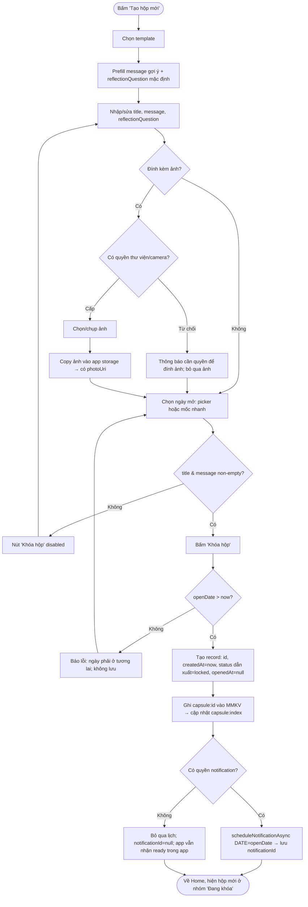

# F1 — Tạo hộp thời gian (Activity Diagram)

Nguồn: PRD.md F1, F6, F8, F9 + AC mục 5 + A4/A7/A9. Bao gồm: validate ngày tương lai, chọn template (F9), đính kèm ảnh optional (F8), lên lịch notification (F6).

Ghi chú gộp: **F2 (khóa & bảo vệ trước hạn) không có diagram riêng** — F2 là bất biến xuyên suốt (nội dung immutable + ẩn nội dung khi `now < openDate`), được thực thi tại điểm ghi bản ghi ở đây và tại điểm hiển thị ở flow F3+F4. Ghi chú F2 gắn trực tiếp trong các flow liên quan thay vì một luồng độc lập.

## Cách người dùng tương tác
1. Từ Home bấm "Tạo hộp mới".
2. Chọn 1 template (free/goal/memory/decision) → form prefill gợi ý nội dung + câu hỏi phản tư mặc định.
3. Nhập/sửa tiêu đề, lời nhắn, (tùy chọn) sửa câu hỏi phản tư.
4. Chọn ngày mở: date picker hoặc mốc nhanh (1 tuần / 1 tháng / 1 năm).
5. (Tùy chọn) đính kèm 1 ảnh từ thư viện hoặc chụp.
6. Bấm "Khóa hộp" → hộp được tạo (`status=locked`), lên lịch notification, quay về Home.

Ràng buộc: luồng ≤ 4 bước, < 60s (Usability NFR). Nút "Khóa hộp" disabled khi thiếu `title`/`message`.

## Luồng nghiệp vụ chính

## Decision points
- **Đính kèm ảnh?** (F8, optional — hủy vẫn tạo được hộp).
- **Có quyền thư viện/camera?** (xin đúng lúc — Security NFR).
- **title & message non-empty?** (chặn khóa nếu thiếu — F1 AC).
- **openDate > now?** (bất biến; chặn ngày quá khứ/hiện tại — F1 AC).
- **Có quyền notification?** (F6 AC — không có quyền vẫn hoạt động, ready nhận diện độc lập).

## Error handling
| Tình huống | Xử lý |
|---|---|
| Thiếu title/message | Nút "Khóa hộp" disabled, không cho tiếp. |
| openDate ≤ now (kể cả mốc nhanh trên máy sai giờ đã trôi) | Báo lỗi rõ ràng, giữ nguyên form, không tạo hộp. |
| Từ chối quyền ảnh | Thông báo nhẹ, bỏ qua ảnh, vẫn tạo hộp không ảnh. |
| Từ chối quyền notification | Vẫn tạo hộp; `notificationId=null`; trạng thái ready xác định trong app khi tới hạn. |
| Lên lịch notification lỗi | Nuốt lỗi mềm, `notificationId=null`; không chặn tạo hộp. |
| Hủy giữa chừng (back/thoát) | Không tạo hộp, không mất dữ liệu app khác (F1 AC). |

## Giả định (bổ sung ngoài A1–A9)
- Mốc nhanh (1 tuần/tháng/năm) = `now + khoảng`, tính lại tại thời điểm bấm "Khóa hộp" để đảm bảo `> now`.
- Ảnh được copy (không chỉ tham chiếu URI gốc thư viện) để tồn tại lâu dài kể cả khi ảnh gốc bị xóa (F8 AC "lưu trong vùng lưu trữ app").
