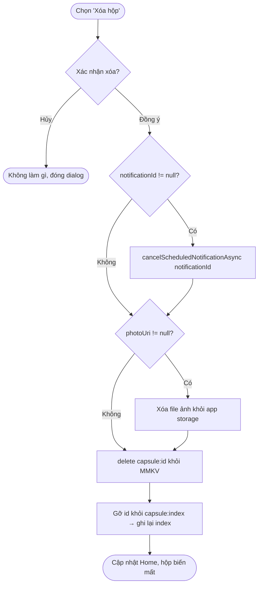

# F10 — Xóa hộp (Activity Diagram)

Nguồn: PRD.md F10 + AC mục 5. Xóa kèm hủy notification (F6) và xóa ảnh (F8). Should-have nhưng có trong scope thiết kế.

## Cách người dùng tương tác
Từ Home hoặc màn chi tiết hộp, người dùng chọn "Xóa" (vd long-press hoặc nút trong menu). App hỏi xác nhận. Đồng ý → hộp, ảnh và notification liên quan bị gỡ hoàn toàn.

Áp dụng cho hộp ở **mọi trạng thái** (locked/ready/opened) — xóa được cho phép (A3), khác với sửa/mở sớm (không cho).

## Luồng nghiệp vụ chính

## Decision points
- **Xác nhận xóa?** — bắt buộc confirm trước khi xóa (F10 AC).
- **notificationId != null?** — chỉ hủy nếu đã lên lịch (không có quyền notification lúc tạo thì `null`).
- **photoUri != null?** — chỉ xóa file nếu có ảnh.

## Error handling / edge cases
| Tình huống | Xử lý |
|---|---|
| Hủy notification thất bại (id không còn/đã bắn) | Nuốt lỗi mềm, tiếp tục xóa; notification đã bắn không gây hại. |
| Xóa file ảnh thất bại (file đã mất) | Bỏ qua, tiếp tục xóa record (idempotent). |
| Xóa record xong nhưng cập nhật index lỗi | Index còn id mồ côi trỏ tới key đã mất → khi load, `get` trả null → bỏ qua & tự dọn id khỏi index (self-heal). Ưu tiên xóa record trước, index sau. |
| Thoát app giữa chừng | Thao tác từng bước idempotent; lần mở sau load list sẽ bỏ qua/dọn id mồ côi. |

## Giả định
- Thứ tự xóa: hủy notification → xóa ảnh → xóa record → cập nhật index. Chọn xóa record trước index để tránh index trỏ tới bản ghi vẫn tồn tại nhưng "đã xóa dở".
- Không có "thùng rác"/undo ở MVP (YAGNI); confirm dialog là đủ bảo vệ (A3).
