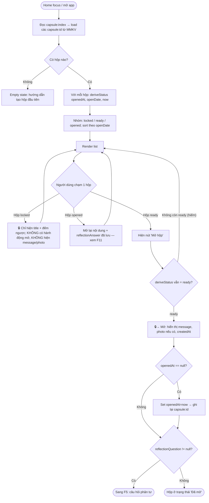

# F3 + F4 — Danh sách hộp & Mở hộp khi tới hạn (Activity Diagram)

Nguồn: PRD.md F3, F4, F2, F7 + AC mục 5 + §5 schema (deriveStatus).

Ghi chú gộp: F3 (list) và F4 (open) gộp một file vì cùng chung màn Home và cùng dùng hàm `deriveStatus`. **F2 (khóa/bảo vệ trước hạn)** thể hiện tại 2 điểm dưới đây (đánh dấu 🔒): card hộp `locked` chỉ hiện metadata; không có nhánh UI nào mở nội dung khi chưa tới hạn.

## Cách người dùng tương tác
1. Mở app → Home hiển thị mọi hộp, nhóm theo trạng thái: Đang khóa / Sẵn sàng mở / Đã mở.
2. Hộp khóa: hiện tiêu đề + đếm ngược ("còn 5 ngày"); **không** hiện nội dung/ảnh.
3. Hộp "Sẵn sàng mở": có nút Mở. Bấm → hiện lời nhắn, ảnh (nếu có), "Bạn đã gửi vào ngày…".
4. Sau khi mở → chuyển tiếp bước phản tư (F5) nếu có câu hỏi; hộp thành "Đã mở".

## Luồng nghiệp vụ chính

## Decision points
- **Có hộp nào?** → empty state vs list (F3 AC).
- **status hiện tại?** (locked / ready / opened) — quyết định card render & hành động, qua `deriveStatus` (§5 schema).
- **deriveStatus vẫn = ready?** — kiểm lại ngay trước khi mở (guard chống mở hộp chưa tới hạn — Reliability NFR).
- **openedAt == null?** — chỉ ghi `openedAt` ở lần mở đầu tiên (immutable sau đó).
- **reflectionQuestion != null?** — có thì sang F5, không thì kết thúc ở "Đã mở".

## Error handling / edge cases
| Tình huống | Xử lý |
|---|---|
| Hộp tới `openDate` khi đang ở Home | Đánh giá lại trạng thái khi màn focus → chuyển nhóm sang "Sẵn sàng mở" không cần restart (F3 AC). |
| Cố mở hộp `locked` | Không tồn tại nhánh UI mở (🔒 F2 AC). Guard `deriveStatus` chặn tuyệt đối. |
| Đồng hồ hệ thống bị chỉnh lùi sau khi đã mở | `openedAt != null` → vẫn `opened`, không quay lại `locked` (Reliability NFR / §5). |
| Ảnh `photoUri` trỏ file đã mất | Hiện placeholder "ảnh không khả dụng", vẫn hiện message. |
| Load store lỗi 1 bản ghi JSON hỏng | Bỏ qua bản ghi lỗi, log, không crash cả list (Crash-free NFR). |

## Giả định
- Đếm ngược cập nhật khi vào màn (F3 AC "cập nhật đúng khi vào màn"); không yêu cầu tick realtime từng giây khi đang đứng yên ở màn — đủ cho MVP.
- Sắp xếp mặc định: trong mỗi nhóm, `ready` gần hạn trước, `locked` sắp tới hạn trước; quyết định cuối do agent-uiux.
