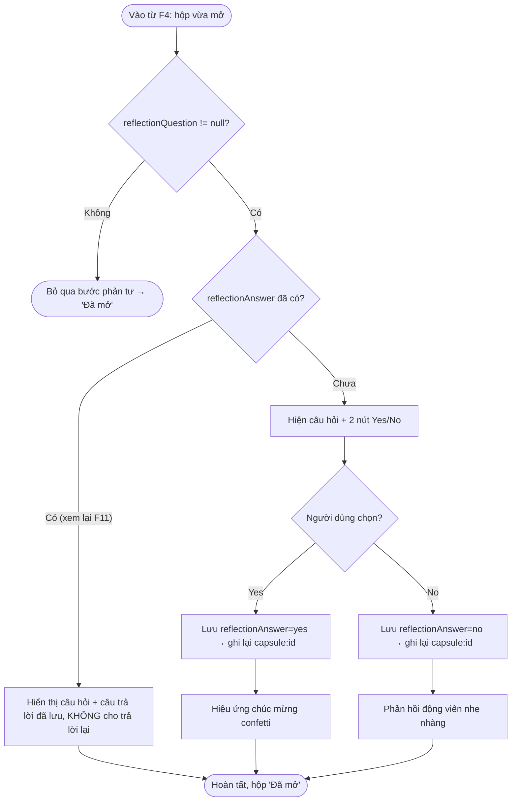

# F5 — Câu hỏi phản tư (Yes/No) + hiệu ứng (Activity Diagram)

Nguồn: PRD.md F5 + AC mục 5 + A5 (Yes/No). Tiếp nối ngay sau F4 (mở hộp).

## Cách người dùng tương tác
Sau khi đọc nội dung hộp vừa mở, nếu hộp có `reflectionQuestion`, màn hiện câu hỏi với 2 nút Yes / No.
- Chọn **Yes** → hiệu ứng chúc mừng (confetti) + lưu `reflectionAnswer=yes`.
- Chọn **No** → phản hồi động viên nhẹ nhàng + lưu `reflectionAnswer=no`.
Câu trả lời lưu 1 lần; lần sau xem lại (F11) chỉ hiển thị, không hỏi lại.

## Luồng nghiệp vụ chính

## Decision points
- **reflectionQuestion != null?** — hộp không có câu hỏi thì bỏ qua toàn bộ bước (F5 AC).
- **reflectionAnswer đã có?** — nếu đã trả lời (đường vào từ xem lại F11) thì chỉ hiển thị, không hỏi lại (F11 AC "không cho trả lời lại").
- **Yes / No** — nhánh hiệu ứng khác nhau; cả hai đều persist câu trả lời.

## Error handling / edge cases
| Tình huống | Xử lý |
|---|---|
| Ghi `reflectionAnswer` lỗi (storage) | Retry ghi; nếu vẫn lỗi, thông báo nhẹ nhưng vẫn hiện hiệu ứng (không chặn cảm xúc). Trạng thái mở đã lưu ở F4 không phụ thuộc bước này. |
| Người dùng thoát màn giữa lúc chọn | `reflectionAnswer` vẫn `null`; lần sau vào hộp `opened` sẽ hỏi lại (vì chưa trả lời) — nhất quán với AC "lưu 1 lần". |
| Đường vào từ F11 (đã trả lời) | Không hiện nút, chỉ hiển thị câu trả lời cũ. |

## Giả định
- Confetti dùng thư viện RN phổ biến (vd `react-native-confetti-cannon` hoặc reanimated), chốt phiên bản ở Implementation (Constraints mục 7).
- Phản hồi "No" mang tính động viên, không phán xét — giọng ấm áp (Usability NFR).
