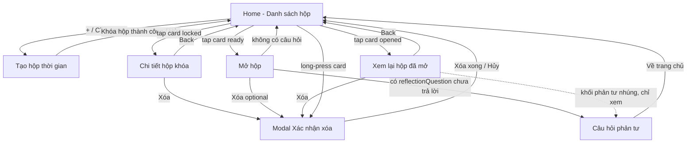

# Screen Descriptions

Nguồn: PRD.md (F1–F11), design/flows/*.md, design/database/schema.md (deriveStatus). Phong cách: tiếng Việt, giọng điệu ấm áp/cá nhân (Usability NFR), tối giản, ưu tiên một tay dùng dọc.

Danh sách 7 screens + 1 modal cho MVP:
1. Home (Danh sách hộp) — F3
2. Tạo hộp thời gian — F1, F8, F9
3. Chi tiết hộp khóa — F2
4. Mở hộp — F4
5. Câu hỏi phản tư — F5
6. Xem lại hộp đã mở — F11
7. Xác nhận xóa hộp (Modal) — F10

Ghi chú gộp: "Chi tiết hộp khóa" và "Mở hộp"/"Xem lại hộp đã mở" là 3 screen tách biệt (không gộp) vì nội dung hiển thị khác nhau hoàn toàn theo status (locked ẩn nội dung tuyệt đối — F2; ready hiện animation "bóc hộp"; opened hiện lại tĩnh không animation) — gộp chung dễ dẫn tới lộ nội dung do lỗi điều kiện render. "Câu hỏi phản tư" tách khỏi "Mở hộp" vì đây là bước có thể lặp lại độc lập (từ F11 khi opened nhưng chưa trả lời) và có state riêng (Yes/No/đã trả lời).

---

## Home (Danh sách hộp)

### Mục đích
Màn hình chính (entry point) của app. Hiển thị toàn bộ hộp thời gian, phân nhóm theo trạng thái dẫn xuất (`deriveStatus`), cho phép vào chi tiết từng hộp và tạo hộp mới.

### Các thành phần chính
1. **Header**
   - Mô tả: Tiêu đề app "FutureBoxes" (hoặc logo nhỏ) căn trái, nút "+" tròn (floating hoặc trong header) căn phải để tạo hộp mới.
   - Tương tác: Tap nút "+" → sang màn Tạo hộp thời gian.
   - Hiệu ứng: Không có animation đặc biệt; nút "+" có ripple/scale nhẹ khi nhấn (pressed state ~0.95 scale, 100ms).

2. **Section "Sẵn sàng mở"** (hiển thị đầu tiên nếu có, để nhấn mạnh hành động chờ đợi nhất)
   - Mô tả: Card nổi bật hơn nhóm khác (viền màu nhấn/glow nhẹ), mỗi card gồm: title, icon phong bì đang "rung nhẹ" hoặc mở hé, badge "Sẵn sàng mở 🎉".
   - Tương tác: Tap card → sang màn Mở hộp. Long-press → hiện menu contextual (Xóa) → mở Modal xác nhận xóa.
   - Hiệu ứng: Card mới chuyển vào nhóm này (do đến `openDate` khi app đang mở) có hiệu ứng highlight/pulse ngắn 1 lần để thu hút chú ý.

3. **Section "Đang khóa"**
   - Mô tả: Danh sách card, mỗi card gồm: title, icon ổ khóa 🔒, dòng đếm ngược ("còn 5 ngày" / "còn 3 giờ" — tự chọn đơn vị lớn nhất còn ý nghĩa), KHÔNG hiển thị message/photo (F2).
   - Tương tác: Tap card → sang màn Chi tiết hộp khóa (chỉ metadata, không có hành động "Mở"). Long-press → menu Xóa.
   - Hiệu ứng: Không animation đặc biệt; card có opacity/màu nền trầm hơn nhóm "Sẵn sàng mở" để phân cấp thị giác.

4. **Section "Đã mở"**
   - Mô tả: Danh sách card gọn hơn (compact row: title + ngày đã mở + icon nhỏ thể hiện `reflectionAnswer` nếu có, vd ✅/💛), không đếm ngược.
   - Tương tác: Tap card → sang màn Xem lại hộp đã mở. Long-press → menu Xóa.
   - Hiệu ứng: Không animation đặc biệt.

5. **FlatList / SectionList tổng**
   - Mô tả: Toàn bộ 3 nhóm trên render trong một SectionList có sticky header theo tên nhóm; sort trong nhóm theo `openDate` (ready/locked: gần hạn trước; opened: mới mở trước).
   - Tương tác: Scroll dọc; pull-to-refresh để re-derive status ngay lập tức (dù đã tự re-derive khi focus).
   - Hiệu ứng: Pull-to-refresh spinner chuẩn platform.

6. **Empty state**
   - Mô tả: Khi chưa có hộp nào — hình minh họa hộp quà/đồng hồ cát tối giản + text ấm áp (vd "Chưa có hộp nào. Gửi một lời nhắn cho chính mình trong tương lai nhé!") + nút CTA lớn "Tạo hộp đầu tiên".
   - Tương tác: Tap CTA → sang màn Tạo hộp thời gian (giống nút "+").
   - Hiệu ứng: Fade-in nhẹ khi vào màn lần đầu.

### Navigation
- Đến screen này từ: Tạo hộp thời gian (sau khi khóa hộp thành công), Xem lại hộp đã mở / Chi tiết hộp khóa / Mở hộp (nút Back), tap local notification (điều hướng thẳng vào Home, F6), lần mở app đầu tiên (entry point).
- Từ screen này đến: Tạo hộp thời gian (nút "+"/CTA empty state), Chi tiết hộp khóa (tap card "Đang khóa"), Mở hộp (tap card "Sẵn sàng mở"), Xem lại hộp đã mở (tap card "Đã mở"), Modal Xác nhận xóa hộp (long-press bất kỳ card nào).

### Ghi chú
- Trạng thái được re-derive (`deriveStatus`) mỗi khi màn hình focus (React Navigation `useFocusEffect`), không cần restart app (F3 AC).
- Giả định: đếm ngược không tick real-time từng giây khi đứng yên ở màn (theo giả định flow F3+F4), chỉ tính lại khi focus/pull-to-refresh — đủ cho MVP, tránh tốn pin/CPU không cần thiết.
- Giả định UI: 3 section luôn hiển thị đúng thứ tự Sẵn sàng mở → Đang khóa → Đã mở kể cả khi rỗng từng phần (ẩn section rỗng, không hiện tiêu đề nhóm không có item), để giữ nhịp điệu và tránh trống trải.
- Ảnh `photoUri` hỏng (file mất) không xảy ra ở Home vì Home không hiển thị ảnh — chỉ liên quan tới màn Mở hộp/Xem lại.

---

## Tạo hộp thời gian

### Mục đích
Cho người dùng soạn một hộp thời gian mới: chọn template gợi ý, nhập nội dung, chọn ngày mở trong tương lai, đính kèm ảnh tùy chọn — hoàn thành trong ≤ 4 bước, < 60s (Usability NFR).

### Các thành phần chính
1. **Header**
   - Mô tả: Nút "Hủy"/"X" bên trái, tiêu đề "Tạo hộp mới" ở giữa, không có nút Save ở header (save nằm ở nút chính cuối form để tránh bấm nhầm sớm).
   - Tương tác: Tap "Hủy" → nếu form có dữ liệu đã nhập, hiện confirm nhỏ "Hủy và mất nội dung đang soạn?"; đồng ý → về Home không tạo hộp gì (F1 AC "hủy giữa chừng không mất dữ liệu app khác").
   - Hiệu ứng: Modal confirm hủy fade+scale nhẹ.

2. **Template Selector** (F9)
   - Mô tả: 4 thẻ nằm ngang (horizontal scroll hoặc grid 2x2), mỗi thẻ có icon + tên: "Lời nhắn tự do" 💌 / "Mục tiêu" 🎯 / "Kỷ niệm" 📸 / "Quyết định" 🤔. Thẻ đang chọn có viền nhấn.
   - Tương tác: Tap 1 thẻ → prefill placeholder gợi ý vào ô message và prefill `reflectionQuestion` mặc định (vd goal → "Bạn đã đạt mục tiêu chưa?"); người dùng sửa tự do sau đó (F9 AC).
   - Hiệu ứng: Chuyển template → nội dung ô message/câu hỏi cross-fade nhẹ (150ms) khi thay prefill, không giật cục.

3. **Input Tiêu đề** (`title`)
   - Mô tả: TextInput 1 dòng, placeholder "Tiêu đề ngắn cho hộp này...".
   - Tương tác: Focus → border đổi màu nhấn; nhập tối đa ~60 ký tự (giới hạn hợp lý, không có trong PRD — giả định UX).
   - Hiệu ứng: Không animation đặc biệt.

4. **Input Lời nhắn** (`message`)
   - Mô tả: TextInput multiline (~4-6 dòng, auto-grow), prefilled theo template, placeholder đổi theo template đã chọn.
   - Tương tác: Focus/nhập tự do; scroll trong ô khi dài; bàn phím không che nút hành động (KeyboardAvoidingView).
   - Hiệu ứng: Không animation đặc biệt.

5. **Input Câu hỏi phản tư** (`reflectionQuestion`, optional)
   - Mô tả: TextInput 1 dòng nhỏ hơn, dưới nhãn "Câu hỏi cho tương lai (Yes/No)", prefilled theo template; có thể xóa trắng để bỏ qua bước phản tư khi mở (F5 AC "không có câu hỏi thì bỏ qua").
   - Tương tác: Sửa tự do hoặc xóa hết để tắt.
   - Hiệu ứng: Không animation đặc biệt.

6. **Photo Picker** (F8, optional)
   - Mô tả: Ô vuông preview (nếu chưa chọn: icon camera + text "Thêm ảnh (tùy chọn)"; nếu đã chọn: thumbnail ảnh + nút "x" nhỏ góc để gỡ).
   - Tương tác: Tap ô trống → action sheet "Chụp ảnh" / "Chọn từ thư viện" / "Hủy" → xin quyền tương ứng nếu chưa có. Từ chối quyền → toast nhẹ "Cần quyền truy cập để đính ảnh" và bỏ qua ảnh, vẫn tạo hộp được (F8 AC). Tap "x" trên thumbnail → gỡ ảnh đã chọn.
   - Hiệu ứng: Ảnh chọn xong fade-in vào ô preview.

7. **Date Picker "Ngày mở"** (`openDate`)
   - Mô tả: Hàng nút mốc nhanh "1 tuần" / "1 tháng" / "1 năm" + nút "Chọn ngày khác..." mở native date/time picker. Dưới đó hiển thị dòng tóm tắt đã chọn (vd "Mở vào: 01/08/2026").
   - Tương tác: Tap 1 mốc nhanh → set `openDate = now + khoảng` ngay (tính lại tại thời điểm bấm "Khóa hộp" để đảm bảo vẫn ở tương lai — theo giả định flow F1). Tap "Chọn ngày khác" → mở picker, chọn ngày+giờ tùy ý.
   - Hiệu ứng: Mốc nhanh đang chọn có highlight; đổi lựa chọn → dòng tóm tắt cập nhật ngay, không animation nặng.

8. **Nút "Khóa hộp"** (CTA chính, cuối form)
   - Mô tả: Nút full-width, icon ổ khóa, disabled (màu xám/opacity thấp) khi `title` hoặc `message` rỗng.
   - Tương tác: Tap khi enabled → validate `openDate > now`; nếu fail hiện lỗi inline dưới phần Date Picker ("Ngày mở phải ở tương lai") và không lưu; nếu pass → tạo hộp, lên lịch notification, điều hướng về Home.
   - Hiệu ứng: Tap → loading spinner ngắn trong nút (thao tác ghi MMKV + schedule notification là gần như tức thời nhưng vẫn hiện spinner tối thiểu ~300ms để tránh cảm giác giật); thành công → toast/snackbar ấm áp "Hộp đã được khóa! Hẹn gặp lại vào [ngày]" rồi pop về Home.

### Navigation
- Đến screen này từ: Home (nút "+" hoặc CTA empty state).
- Từ screen này đến: Home (sau khi "Khóa hộp" thành công, hoặc "Hủy" xác nhận).

### Ghi chú
- Giả định UX (PRD/flow không quy định chi tiết UI): giới hạn ký tự tiêu đề ~60, đây là lựa chọn hợp lý để tránh tràn UI card ở Home, không phải yêu cầu cứng từ PRD.
- Validate ngày quá khứ/hiện tại chỉ chặn ở bước bấm "Khóa hộp" (không chặn realtime khi đang chọn) để không làm phiền người dùng đang thao tác với mốc nhanh.
- Thứ tự trường trên form tuân theo luồng flow F1 (template → nội dung → ảnh → ngày → khóa) nhưng ảnh và ngày có thể đảo vị trí thị giác nếu cần cân bố cục — không ảnh hưởng nghiệp vụ.
- Toàn bộ nội dung nhập ở đây trở thành immutable ngay sau khi tạo (F2) — không có màn "sửa hộp" trong MVP.

---

## Chi tiết hộp khóa

### Mục đích
Hiển thị một hộp đang ở trạng thái `locked` — CHỈ metadata, tuyệt đối không lộ `message`/`photo` (bất biến cốt lõi F2).

### Các thành phần chính
1. **Header**
   - Mô tả: Nút Back bên trái, không có tiêu đề đặc biệt (hoặc "Chi tiết hộp").
   - Tương tác: Tap Back → về Home.
   - Hiệu ứng: Transition slide chuẩn platform.

2. **Hero Card khóa**
   - Mô tả: Icon ổ khóa lớn/hình minh họa hộp đang đóng kín ở giữa màn, `title` hiển thị nổi bật bên dưới.
   - Tương tác: Không tương tác (thuần hiển thị) — không có bất kỳ nút "Xem trước"/"Mở" nào (F2 AC: không tồn tại đường dẫn UI mở nội dung trước hạn).
   - Hiệu ứng: Không animation nặng; có thể có hiệu ứng "thở nhẹ" (subtle breathing scale 1.0↔1.02, loop chậm) trên icon ổ khóa để gợi cảm giác chờ đợi mà không gây xao nhãng.

3. **Đếm ngược lớn**
   - Mô tả: Text lớn dạng "Còn 5 ngày 3 giờ" hoặc dạng đồng hồ đếm ngược tĩnh (không cần tick giây), kèm dòng phụ "Mở vào: 01/08/2026, 09:00".
   - Tương tác: Không tương tác.
   - Hiệu ứng: Không animation đặc biệt (nhất quán với Home — không tick realtime).

4. **Thông tin phụ**
   - Mô tả: Dòng nhỏ "Bạn đã tạo hộp này vào [createdAt]"; badge template (icon nhỏ tương ứng template đã chọn) để gợi nhớ loại hộp mà không lộ nội dung.
   - Tương tác: Không tương tác.
   - Hiệu ứng: Không.

5. **Nút "Xóa hộp"** (F10, để icon thùng rác nhỏ ở header hoặc cuối màn, không quá nổi bật)
   - Mô tả: Icon/text nhỏ, màu trung tính hoặc hơi cảnh báo (không đỏ gắt để tránh xóa nhầm).
   - Tương tác: Tap → mở Modal Xác nhận xóa hộp.
   - Hiệu ứng: Không.

### Navigation
- Đến screen này từ: Home (tap card nhóm "Đang khóa").
- Từ screen này đến: Home (Back, hoặc sau khi xóa thành công qua Modal).

### Ghi chú
- Đây là điểm thực thi quan trọng nhất của F2 — code review cần đảm bảo component này KHÔNG bao giờ nhận hoặc render `message`/`photoUri` dù có trong props (defense-in-depth: không chỉ ẩn bằng điều kiện UI mà tốt nhất không truyền dữ liệu nhạy cảm xuống màn này).
- Giả định: hiệu ứng "thở nhẹ" trên icon khóa là lựa chọn thẩm mỹ tự quyết (agent-uiux), có thể bỏ nếu ưu tiên performance/pin trên thiết bị yếu.

---

## Mở hộp

### Mục đích
Khoảnh khắc cảm xúc chính của app: hộp `ready` được mở lần đầu (hoặc mở lại trong cùng phiên trước khi có `reflectionAnswer`) — hiển thị `message`, `photo` (nếu có), `createdAt`, rồi dẫn sang Câu hỏi phản tư nếu có.

### Các thành phần chính
1. **Header**
   - Mô tả: Nút Back, không tiêu đề đặc biệt.
   - Tương tác: Tap Back → về Home (chỉ khả dụng ở bước xem nội dung; trong lúc animation "bóc hộp" đang chạy có thể ẩn tạm để không ngắt trải nghiệm).
   - Hiệu ứng: Transition chuẩn platform.

2. **Animation "Bóc hộp"** (unbox moment, chạy 1 lần khi vào màn với hộp vừa chuyển sang mở)
   - Mô tả: Hình minh họa hộp quà đóng → tap hoặc tự động sau khi vào màn → hộp "mở nắp"/vỡ ra nhẹ nhàng, chuyển cảnh sang nội dung bên trong.
   - Tương tác: Tap vào hộp để "mở" (chủ động, tăng cảm giác nghi thức) thay vì tự động ngay lập tức — tôn trọng khoảnh khắc chờ đợi mà PRD nhấn mạnh ("cảm giác chờ đợi và bất ngờ khi mở hộp").
   - Hiệu ứng: Scale + fade + có thể kèm hạt sáng nhẹ (particle nhỏ) khi nắp hộp mở, ~500-700ms, easing ease-out.

3. **Guard re-check trạng thái** (không phải UI hiển thị, nhưng ảnh hưởng luồng): trước khi cho phép animation "bóc hộp" chạy, kiểm tra lại `deriveStatus` vẫn = `ready`; nếu do race hiếm gặp không còn ready, quay lại Home (theo flow F3+F4 "ReDerive").

4. **Nội dung hộp** (hiện sau animation bóc hộp)
   - Mô tả: `title` làm heading; dòng nhỏ "Bạn đã gửi vào ngày [createdAt]"; ảnh `photo` (nếu có) hiển thị full-width bo góc phía trên; `message` hiển thị dạng văn bản lớn, dễ đọc, căn giữa hoặc trái tùy độ dài.
   - Tương tác: Scroll nếu nội dung dài; không có nút edit/share ở MVP.
   - Hiệu ứng: Nội dung fade-in + slide-up nhẹ (staggered: ảnh trước, rồi text) ngay sau animation bóc hộp.

5. **Xử lý ảnh lỗi**
   - Mô tả: Nếu `photoUri` trỏ tới file đã mất, hiển thị placeholder (icon ảnh vỡ + text "Ảnh không còn khả dụng"), vẫn hiển thị `message` bình thường (theo edge case flow F3+F4).
   - Tương tác: Không tương tác đặc biệt trên placeholder.
   - Hiệu ứng: Không.

6. **Nút "Tiếp tục"** (chuyển sang bước phản tư hoặc kết thúc)
   - Mô tả: Nút full-width cuối màn, label động: "Tiếp tục" (nếu có `reflectionQuestion`) hoặc "Xong" (nếu không có).
   - Tương tác: Tap → set `openedAt=now` (nếu lần mở đầu tiên) và ghi lại record → nếu có `reflectionQuestion` sang Câu hỏi phản tư; nếu không, quay về Home với hộp giờ ở nhóm "Đã mở".
   - Hiệu ứng: Nút xuất hiện fade-in cùng nhịp với nội dung, hơi trễ hơn (sau khi đọc xong phần đầu).

### Navigation
- Đến screen này từ: Home (tap card nhóm "Sẵn sàng mở").
- Từ screen này đến: Câu hỏi phản tư (nếu có `reflectionQuestion` và chưa trả lời), Home (nếu không có câu hỏi phản tư, hoặc Back giữa chừng trước khi bấm "Tiếp tục" — `openedAt` vẫn được set ngay khi nội dung đã hiển thị theo flow, không chờ đến khi bấm nút, để nhất quán với AC F4 "sau khi mở lần đầu status=opened").

### Ghi chú
- Quyết định thiết kế: `openedAt` được set ngay khi nội dung hiển thị xong (không chờ nút "Tiếp tục"), vì F4 AC nói "sau khi mở lần đầu" — việc đã đọc nội dung tức là đã "mở". Nút "Tiếp tục" chỉ điều hướng bước tiếp theo, không phải điều kiện set trạng thái. Cần agent-react xác nhận thời điểm ghi chính xác khi implement.
- Animation bóc hộp là điểm nhấn cảm xúc quan trọng theo PRD — nhưng phải nhẹ (đơn giản hơn ảnh phức tạp, theo Performance NFR "ưu tiên gradient đơn giản hơn hình ảnh phức tạp"), dùng Reanimated, không dùng video/Lottie nặng nếu không cần thiết.
- Nếu người dùng vào lại hộp đã `opened` nhưng CHƯA có `reflectionAnswer` (thoát giữa chừng ở bước phản tư trước đó), Home điều hướng thẳng tới Câu hỏi phản tư (không qua lại animation bóc hộp) — không phải màn Xem lại, vì phản tư chưa hoàn tất (theo flow F5 "Người dùng thoát màn giữa lúc chọn").

---

## Câu hỏi phản tư

### Mục đích
Hỏi Yes/No sau khi đọc nội dung hộp, tạo khoảnh khắc phản tư giữa kỳ vọng lúc gửi và thực tế lúc mở, với hiệu ứng cảm xúc tương ứng.

### Các thành phần chính
1. **Câu hỏi**
   - Mô tả: `reflectionQuestion` hiển thị dạng heading lớn, căn giữa màn (vd "Bạn đã đạt mục tiêu chưa?").
   - Tương tác: Không tương tác trực tiếp trên text.
   - Hiệu ứng: Fade-in + slight scale khi vào màn.

2. **2 nút Yes / No**
   - Mô tả: 2 nút lớn cạnh nhau (hoặc xếp dọc trên màn hẹp), Yes màu tích cực (xanh lá/ấm), No màu trung tính (không dùng đỏ để tránh cảm giác "sai/phạt" — giọng điệu không phán xét theo NFR Usability).
   - Tương tác: Tap 1 trong 2 → disable cả hai ngay lập tức (tránh double-tap ghi đè), lưu `reflectionAnswer` tương ứng.
   - Hiệu ứng: Nút được chọn scale nhẹ lên rồi giữ highlight; nút còn lại fade mờ dần.

3a. **Nhánh Yes: Hiệu ứng chúc mừng**
   - Mô tả: Confetti/particle phủ toàn màn hình, kèm text động viên lớn (vd "Tuyệt vời! Chúc mừng bạn 🎉").
   - Tương tác: Tap bất kỳ đâu hoặc tự động sau ~2-3s → hiện nút "Về trang chủ".
   - Hiệu ứng: Confetti cannon chạy 1 lần (~1.5-2s), kèm haptic feedback nhẹ (success) nếu thiết bị hỗ trợ.

3b. **Nhánh No: Phản hồi động viên**
   - Mô tả: Hình minh họa nhẹ nhàng (vd nhân vật ôm/vỗ vai) + text động viên không phán xét (vd "Không sao cả, mỗi hành trình đều có nhịp riêng. Tiếp tục cố gắng nhé!").
   - Tương tác: Tap "Về trang chủ" để kết thúc.
   - Hiệu ứng: Fade-in nhẹ nhàng, không có hiệu ứng "rực rỡ" như nhánh Yes (đối lập chủ đích để tôn trọng cảm xúc).

4. **Chế độ chỉ xem** (khi vào từ Xem lại hộp đã mở, `reflectionAnswer` đã có)
   - Mô tả: Hiển thị lại câu hỏi + câu trả lời đã chọn (nút Yes/No tương ứng ở trạng thái "đã chọn", còn lại mờ/disabled), KHÔNG cho tap lại, không replay hiệu ứng confetti.
   - Tương tác: Chỉ có nút Back, không có hành động chọn.
   - Hiệu ứng: Không animation (hiển thị tĩnh, tôn trọng AC F11 "không cho trả lời lại").

### Navigation
- Đến screen này từ: Mở hộp (ngay sau khi đọc nội dung, nếu có `reflectionQuestion` và chưa trả lời), Xem lại hộp đã mở (chế độ chỉ xem, nếu đã có `reflectionAnswer`).
- Từ screen này đến: Home (sau khi chọn Yes/No và tap "Về trang chủ", hoặc Back ở chế độ chỉ xem).

### Ghi chú
- Giả định: nếu ghi `reflectionAnswer` vào storage lỗi, vẫn hiện hiệu ứng ngay (không chặn cảm xúc người dùng chờ storage), retry ngầm — theo error handling của flow F5.
- Nếu người dùng thoát màn này giữa chừng (chưa chọn Yes/No), `reflectionAnswer` vẫn `null`; lần sau vào lại hộp `opened` này sẽ hỏi lại từ đầu (không phải chế độ chỉ xem) — nhất quán với flow F5.
- Thư viện confetti cụ thể (vd `react-native-confetti-cannon` hoặc Reanimated tự dựng) chốt ở giai đoạn Implementation.

---

## Xem lại hộp đã mở

### Mục đích
Cho người dùng truy cập lại đầy đủ nội dung và câu trả lời phản tư của một hộp đã ở trạng thái `opened`, không cho sửa/trả lời lại (F11).

### Các thành phần chính
1. **Header**
   - Mô tả: Nút Back, tiêu đề nhỏ có thể là `title` của hộp.
   - Tương tác: Tap Back → về Home.
   - Hiệu ứng: Transition chuẩn platform.

2. **Nội dung tĩnh**
   - Mô tả: Giống bố cục phần "Nội dung hộp" ở màn Mở hộp (title, `createdAt`, ảnh nếu có, `message`) nhưng KHÔNG có animation "bóc hộp" — hiển thị ngay lập tức toàn bộ, vì đây là xem lại chứ không phải khoảnh khắc mở đầu tiên.
   - Tương tác: Scroll nếu dài.
   - Hiệu ứng: Fade-in nhẹ khi vào màn (không có hiệu ứng "unbox").

3. **Dòng "Đã mở vào"**
   - Mô tả: Thêm dòng phụ so với màn Mở hộp: "Bạn đã mở hộp này vào [openedAt]" — cung cấp bối cảnh thời gian đầy đủ (gửi lúc nào, mở lúc nào).
   - Tương tác: Không.
   - Hiệu ứng: Không.

4. **Khối Câu hỏi phản tư (nếu có)**
   - Mô tả: Nếu `reflectionQuestion != null`, hiển thị nhúng khối câu hỏi + câu trả lời đã lưu (tái sử dụng component "chế độ chỉ xem" của màn Câu hỏi phản tư) ngay dưới nội dung, thay vì điều hướng sang màn riêng — giảm 1 lần chuyển màn cho trải nghiệm xem lại nhanh gọn hơn.
   - Tương tác: Không tương tác (chỉ xem).
   - Hiệu ứng: Không.

5. **Nút "Xóa hộp"**
   - Mô tả: Icon/text nhỏ ở header hoặc cuối màn, giống màn Chi tiết hộp khóa.
   - Tương tác: Tap → mở Modal Xác nhận xóa hộp.
   - Hiệu ứng: Không.

### Navigation
- Đến screen này từ: Home (tap card nhóm "Đã mở").
- Từ screen này đến: Home (Back, hoặc sau khi xóa thành công).

### Ghi chú
- Quyết định gộp khối phản tư ngay trong màn này (thay vì điều hướng sang màn Câu hỏi phản tư riêng) là lựa chọn UX của agent-uiux để giảm số lần chuyển màn khi chỉ xem lại — về mặt logic vẫn tái dùng đúng component "chế độ chỉ xem" đã mô tả ở màn Câu hỏi phản tư, agent-react có thể chọn tách route riêng nếu thuận tiện hơn cho điều hướng, miễn giữ đúng hành vi "không cho trả lời lại".
- Nếu hộp `opened` nhưng `reflectionAnswer` vẫn `null` (có câu hỏi nhưng chưa trả lời do thoát giữa chừng trước đó), Home không điều hướng vào màn này mà điều hướng thẳng vào Câu hỏi phản tư ở chế độ hỏi (xem ghi chú màn Mở hộp) — màn Xem lại chỉ dùng khi đã hoàn tất phản tư hoặc không có câu hỏi.

---

## Xác nhận xóa hộp (Modal)

### Mục đích
Yêu cầu xác nhận trước khi xóa vĩnh viễn 1 hộp (mọi trạng thái), tránh xóa nhầm do long-press/tap lỡ tay.

### Các thành phần chính
1. **Overlay + Dialog**
   - Mô tả: Nền mờ tối (dim background) phía sau, dialog trung tâm nhỏ gồm: icon cảnh báo nhẹ, text "Xóa hộp này?", dòng phụ "Hành động này không thể hoàn tác. Hộp, ảnh và thông báo liên quan sẽ bị xóa vĩnh viễn." (giải thích rõ hệ quả theo flow F10: hủy notification + xóa ảnh + xóa record).
   - Tương tác: Tap ra ngoài dialog (overlay) → coi như "Hủy", đóng dialog không làm gì.
   - Hiệu ứng: Overlay fade-in, dialog scale+fade từ 0.9→1.0 (~200ms).

2. **Nút "Hủy"**
   - Mô tả: Nút phụ (outline/text), bên trái hoặc trên.
   - Tương tác: Tap → đóng dialog, không thay đổi gì.
   - Hiệu ứng: Dialog fade+scale out.

3. **Nút "Xóa"**
   - Mô tả: Nút chính, màu cảnh báo (đỏ/cam) để phân biệt rõ với hành động thường, bên phải hoặc dưới.
   - Tương tác: Tap → thực hiện xóa: hủy notification (nếu có) → xóa file ảnh (nếu có) → xóa record → cập nhật index; đóng dialog; nếu đang ở màn Chi tiết hộp khóa/Mở hộp/Xem lại thì điều hướng về Home; nếu xóa từ long-press trên chính Home thì chỉ đóng dialog và card biến mất khỏi list.
   - Hiệu ứng: Tap → loading spinner ngắn trong nút trong lúc xử lý (thao tác gần như tức thời nhưng vẫn hiện phản hồi); sau khi xong, card tương ứng trên Home biến mất với hiệu ứng fade-out + collapse height nhẹ (~200ms) thay vì biến mất đột ngột.

### Navigation
- Đến screen này từ: Home (long-press bất kỳ card), Chi tiết hộp khóa (nút Xóa), Mở hộp (nếu có nút xóa — tùy chọn, không bắt buộc vì đang ở nghi thức mở), Xem lại hộp đã mở (nút Xóa).
- Từ screen này đến: đóng modal, quay lại đúng màn nền phía sau (Home tự cập nhật list; các màn chi tiết tự điều hướng về Home sau khi xóa).

### Ghi chú
- Modal dùng chung 1 component cho mọi entry point (không tạo route riêng), nhận `capsuleId` làm prop để biết xóa hộp nào.
- Giả định: không có toast "Hoàn tác" (undo) sau khi xóa — theo giả định của flow F10 "Không có thùng rác/undo ở MVP (YAGNI); confirm dialog là đủ bảo vệ".
- Nếu xóa từ màn Mở hộp trước khi hoàn tất bước phản tư, xóa vẫn được phép (A3: xóa áp dụng mọi trạng thái) — không có ràng buộc chặn.

---

## Navigation Flow tổng quan

Entry point chính: **Home**. Luồng chính: Home → Tạo hộp → (chờ đến `openDate`) → Home (nhóm "Sẵn sàng mở") → Mở hộp → Câu hỏi phản tư → Home (nhóm "Đã mở") → Xem lại hộp đã mở (bất cứ lúc nào sau đó). Notification cục bộ (F6) khi tới hạn đưa người dùng thẳng về Home. Xóa hộp (F10) khả dụng từ Home và mọi màn chi tiết, ở mọi trạng thái hộp.
